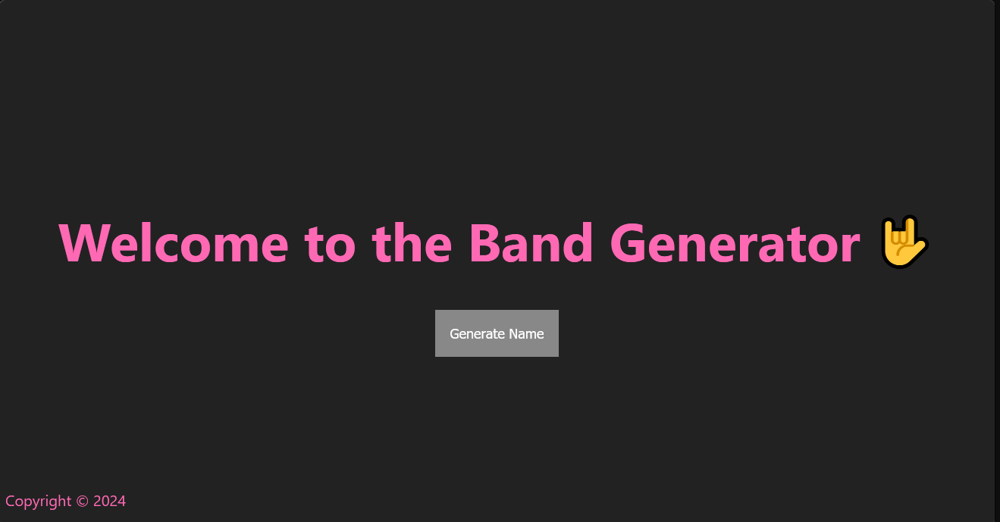

# Band Name Generator 🎸🎶

This is a simple Node.js application that generates random band names when a button is pressed. Whether you're looking for a name for your next music project or just having fun, this app has you covered!

## Features
- Generates random and unique band names with a single click.
- Lightweight and fast server-side processing using Node.js.

## Demo
  
_A preview of the Band Name Generator interface._

## Installation and Setup

1. **Clone the repository**:
   ```bash
   git clone https://github.com/yourusername/band-name-generator.git
   cd band-name-generator
